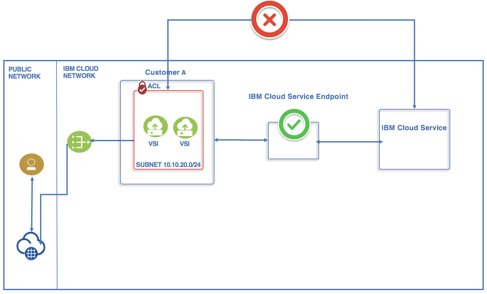

---

copyright:
  years: 2018, 2019
lastupdated: "2019-06-28"

keywords: service endpoint, private network endpoint, connect service to private network

subcollection: resources

---

{:shortdesc: .shortdesc}
{:new_window: target="_blank"}
{:codeblock: .codeblock}
{:pre: .pre}
{:screen: .screen}
{:tip: .tip}
{:download: .download}

# Service endpoints for private network connections
{: #service-endpoints}

An increased focus on security is required by customers that use cloud-based services for production workloads. For many customers, accessing services in a secure manner is not only a sensible corporate policy, but in some cases required by compliance regulations. {{site.data.keyword.IBM_notm}} has enhanced the connectivity options for customers who require isolated connectivity options for their workloads. 

With {{site.data.keyword.cloud}} service endpoints, you can connect to {{site.data.keyword.cloud_notm}} services over the {{site.data.keyword.cloud_notm}} private network. Moving these workloads from the public network offers two advantages:

* Services are no longer served on an internet routable IP address. It is becoming increasingly common for cloud consumers to want limited or no access to the public internet from any of their services. Now with the service endpoint feature, service teams can create an interface over the private network for their service that customers can use to connect. Internet access is no longer a requirement for you to connect to {{site.data.keyword.cloud_notm}} services.
* There is no billable or metered bandwidth charges on the private network. In the past, you were billed for egress bandwidth when talking to an {{site.data.keyword.cloud_notm}} service. 

The following figure shows how traffic is routed through {{site.data.keyword.cloud_notm}}'s private network when accessing cloud services through service endpoints:

To use {{site.data.keyword.cloud_notm}} service endpoints, you must enable virtual routing and forwarding (VRF) in your account.  Then, you can enable the use of service endpoints. After both options are enabled, you can start creating services that support the use of VRF and service endpoints from the catalog. For more information, see [Enabling VRF and service endpoints](/docs/account?topic=account-vrf-service-endpoint).
